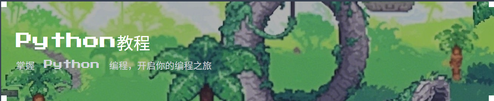

我喜欢探索新事物！以下是我的几个主要兴趣爱好：

### 1. 编程和开源项目
我热衷于使用 Python 和其他语言解决实际问题。我经常在 GitHub 上贡献代码，也喜欢维护自己的小项目。

### 2. 美食与烹饪
我喜欢通过烹饪来表达创造力。无论是家常菜还是新奇的料理，我都享受从准备食材到做出美味佳肴的整个过程。

### 3. 远足与旅行
我喜欢徒步旅行，探索未知的山路和风景优美的步道。每一次旅行都是一次身心的放松和充电。
